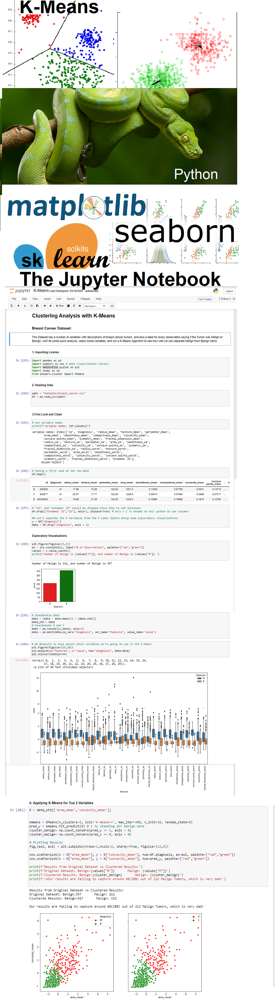

# Machine Learning - Unsupervised Learning - Clustering with K-Means
K-Means is a Clusterization Algorithm.  With numerical data as inputs, the K-means tries to separate the different observations in the Dataset into different groups each. 
If you're looking for a clustering that works with categorical data, you should try the k-mode algorithm. 
The principia of the Clustering Algorithms are that things (people, grades, prices, products) that are similar (based in features) should belong to the same bucket, while things that are different, should belong to different buckets.

### Check the Python Libraries we're going to use and the Jupyter Notebook :o
</img>

